Ralf's OpenSCAD designs
-----------------------

:Author: Ralf Schlatterbeck

.. |--| unicode:: U+2013   .. en dash

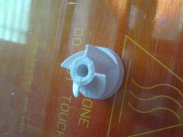

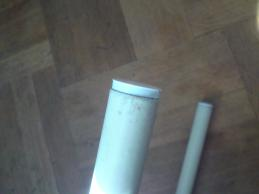

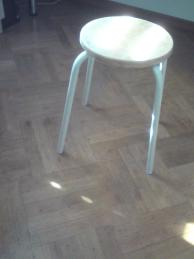

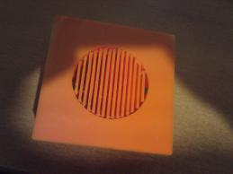

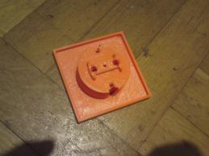

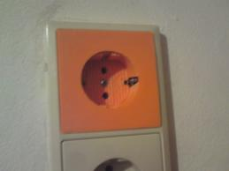

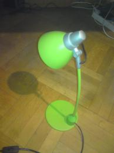

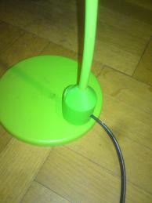

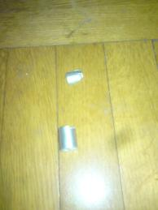

.. |peeler1| image:: pics/peeler-old.jpg
   :alt: picture of old potato peeler

.. |peeler2| image:: pics/peeler.jpg
   :alt: picture of first version of potato peeler

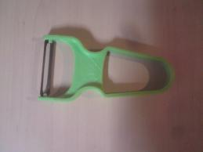

This project contains various OpenSCAD designs. The ``shapes`` directory
contains mostly experiments that might or might not be useful to others.

The ``mendelmax`` subdirectory contains various changes/improvements to my
MendelMax RepRap and has its own README.

The top-level contains the following:

- ``boardmount.scad`` is a shelving peg for holding a board. The photo
  probably makes it clearer.

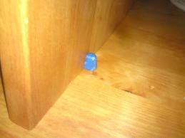

- ``bung.scad`` fits into the leg of a stool for not making scratches on
  the floor. In the pictures you see the original part, parts fit into
  the stool legs and the stool standing on the new bungs.

   +---------+---------+---------+
   | |bung1| | |bung2| | |bung3| |
   +---------+---------+---------+

- ``cabletubeholder.scad`` is a click-on holder for cable tubes. The
  photo shows a dual-holder for two tubes.

.. figure:: pics/cabletube.jpg
   :align: center
   :alt: picture of two cable tubes

   Dual Cable-Tube Holder

.. raw:: html

     

- The `camera-flash-plate.scad` was a quick&dirty hack to replace a lost
  flash-plate for an existing camera of a friend.

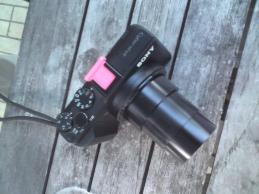

- ``coffeemaker.scad`` contains the necessary parts for an aluminium
  coffee maker with plastic handles (which melt when the whole thing is
  heated without water). Note that there is a reason that the original
  parts are black -- making them white as in this example will not look
  too pretty after a while.

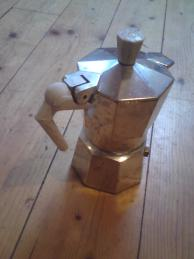

- ``din-power-outlet.scad`` is for a power outlet in Germany and
  Austria. Note that you don't want to make them colored if you have
  children, these like to play with colored things. The leftmost picture
  is the front with support material not yet removed.

   +----------+----------+----------+
   | |power1| | |power2| | |power3| |
   +----------+----------+----------+

- ``fridge.scad``: Refridgerator handle of our Liebherr KB 4250. I
  honestly don't know how we broke it. The handle mechanics is moveable
  and presses against the chassis when pulled. This had to work again
  with the new handle.

.. figure:: pics/old-handle.jpg
   :align: left
   :alt: picture of old fridge handle

   Old Fridge Handle

.. figure:: pics/handle.gif
   :align: right
   :alt: picture of new fridge handle

   New Fridge Handle With Moving Handle Animation

.. raw:: html

     

- ``key.scad`` is an experiment of printing a key to one of our internal
  doors. The key (after some filing) works. I would not recommend it for
  if the keylock jams slightly as it may break in the lock.

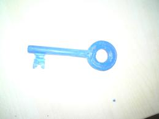

- ``kicker.scad``: Robo-kicker for a tabletop football game. This is
  inspired by the `Robo Soccer Player`_ thing 8176 on Thingiverse, but
  this isn't a parametric design and mine is *slightly* (around 10%)
  smaller. Of course the new design *is* parametric but lacks the
  features of the original (it had to be ready fast, patches accepted)

.. _`Robo Soccer Player`: http://www.thingiverse.com/thing:8176

.. figure:: pics/kicker.jpg
   :align: center
   :alt: picture of tabletop soccer with printed robo kicker

   Tabletop Soccer With Printed Robo Kicker

- ``knob.scad``: parametric knob design for electronics. Sometimes it's
  hard to get a matching knob for a non-standard axis, e.g., a 4.5 mm
  axis of a variable capacitor.

- ``lampfoot.scad`` was used to repair a lamp with a brittle plastic
  part to connect the lamp to the foot of the lamp. If not looking
  carefully it looks like it's made of metal |--| like the other parts
  of the lamp. I consider this an example of design for obsolecense,
  Wikipedia has an interesting article on `planned obsolecense`_

.. _`planned obsolecense`: https://en.wikipedia.org/wiki/Planned_obsolescence

   +-------------+-------------+-------------+
   | |lampfoot1| | |lampfoot2| | |lampfoot3| |
   +-------------+-------------+-------------+

- ``lawnmowerpart.scad``: Handle of a lawnmower. Both handles need to be
  held to keep the motor running. The old design was too brittle.
  The new handles of the lawnmower are in blue, easily seen in the
  picture.

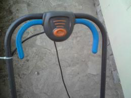

   Lawnmower with replace parts

- ``mousering.scad``: Ring for a mechanical computer mouse that holds
  the ball inside the device.

.. figure:: pics/mouse.jpg
   :align: center
   :alt: picture of mouse with printed ring

   Mouse With New Printed Ring
  
- ``osd-stick.scad`` is a housing for an USB-stick to communicate via
  6loWPAN_. The stick is designed by our `Open Source Domotics` (OSD)
  group, it uses the standard `Merkur board`_ and an off-the-shelf serial
  to USB converter.

.. _6loWPAN: https://en.wikipedia.org/wiki/6LoWPAN
.. _`Open Source Domotics`: http://www.osdomotics.com/
.. _`Merkur board`: http://osdwiki.open-entry.com/doku.php/en:projekte:merkur

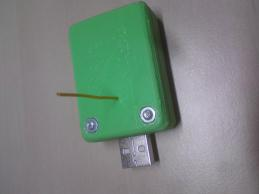

   Closed housing of stick

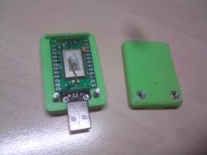

   Opened housing

.. raw:: html

     

- ``nuts.scad`` contains various parameters of common metric nuts and
  associated screws. I'm using this in other designs to not repeatedly
  reinvent the wheel.

- ``peeler.scad`` is a potato (or other vegetable) peeler. The old one
  was broken but we liked the sharp knife of it, so there had to be a
  new one. From left to right you see the old one, an intermediate
  design that lastet for more than a year and the current one which has
  some of the structures enforced. In particular the current slicer
  settings fill in the sides which didn't happen for the first print.

   +-----------+-----------+-----------+
   | |peeler1| | |peeler2| | |peeler3| |
   +-----------+-----------+-----------+

- ``peg.scad`` is my peg design. Thanks to the following animation by
  Clifford Wolf (thanks Clifford!) this will say more than a thousand
  words ... you find the OpenSCAD animation in ``peg_animated.scad``.

.. figure:: https://raw.githubusercontent.com/rsc3d/rsc3d/master/pics/animated.gif
   :align: center
   :alt: peg animation

   Animated Picture of Peg

- ``rummistand.scad``: Stand of tile-holder of a game named "Rummicub".
  These break after a while.

- ``stoppel.scad`` is an experiment to fix a broken screw-hole that
  didn't turn out too well when printed. Maybe with a smaller extruder.

