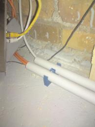
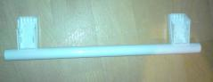
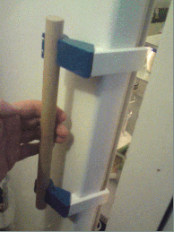
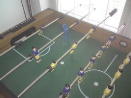
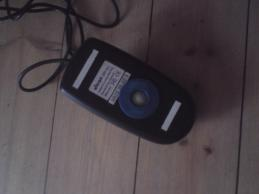
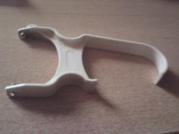
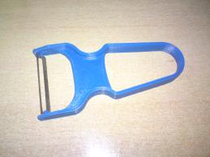

Ralf's OpenSCAD designs
-----------------------

:Author: Ralf Schlatterbeck

This project contains various OpenSCAD designs. The ``shapes`` directory
contains mostly experiments that might or might not be useful to others.

The ``mendelmax`` subdirectory contains various changes/improvements to my
MendelMax RepRap and has its own README.

The top-level contains the following:

- ``cabletubeholder.scad`` is a click-on holder for cable tubes. The
  photo shows a dual-holder for two tubes.

   Dual Cable-Tube Holder

.. raw:: html

     

- ``fridge.scad``: Refridgerator handle of our Liebherr KB 4250. I
  honestly don't know how we broke it. The handle mechanics is moveable
  and presses against the chassis when pulled. This had to work again
  with the new handle.

   Old Fridge Handle

   New Fridge Handle With Moving Handle Animation

.. raw:: html

     

- ``kicker.scad``: Robo-kicker for a tabletop football game. This is
  inspired by the `Robo Soccer Player`_ thing 8176 on Thingiverse, but
  this isn't a parametric design and mine is *slightly* (around 10%)
  smaller. Of course the new design *is* parametric but lacks the
  features of the original (it had to be ready fast, patches accepted)

.. _`Robo Soccer Player`: http://www.thingiverse.com/thing:8176

   Tabletop Soccer With Printed Robo Kicker

- ``knob.scad``: parametric knob design for electronics. Sometimes it's
  hard to get a matching knob for a non-standard axis, e.g., a 4.5 mm
  axis of a variable capacitor.

- ``lawnmowerpart.scad``: Handle of a lawnmower. Both handles need to be
  held to keep the motor running. The old design was too brittle.

- ``mousering.scad``: Ring for a mechanical computer mouse that holds
  the ball inside the device.

   Mouse With New Printed Ring
  
- ``nuts.scad`` contains various parameters of common metric nuts and
  associated screws. I'm using this in other designs to not repeatedly
  reinvent the wheel.

- ``peeler.scad`` is a potato (or other vegetable) peeler. The old one
  was broken but we liked the sharp knife of it, so there had to be a
  new one.

   Old Potato Peeler
  

   New Potato Peeler
  
.. raw:: html

     

- ``peg.scad`` is my peg design. Thanks to the following animation by
  Clifford Wolf (thanks Clifford!) this will say more than a thousand
  words ... you find the OpenSCAD animation in ``peg_animated.scad``.

.. figure:: https://raw.githubusercontent.com/rsc3d/rsc3d/master/pics/animated.gif
   :align: center
   :alt: peg animation

   Animated Picture of Peg

- ``rummistand.scad``: Stand of tile-holder of a game named "Rummicub".
  These break after a while.

- ``stoppel.scad`` is an experiment to fix a broken screw-hole that
  didn't turn out too well when printed. Maybe with a smaller extruder.

